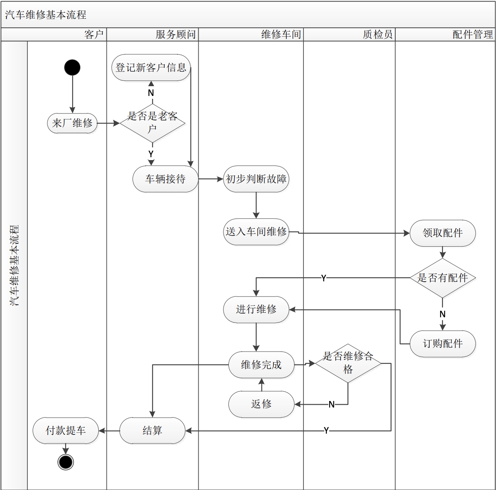
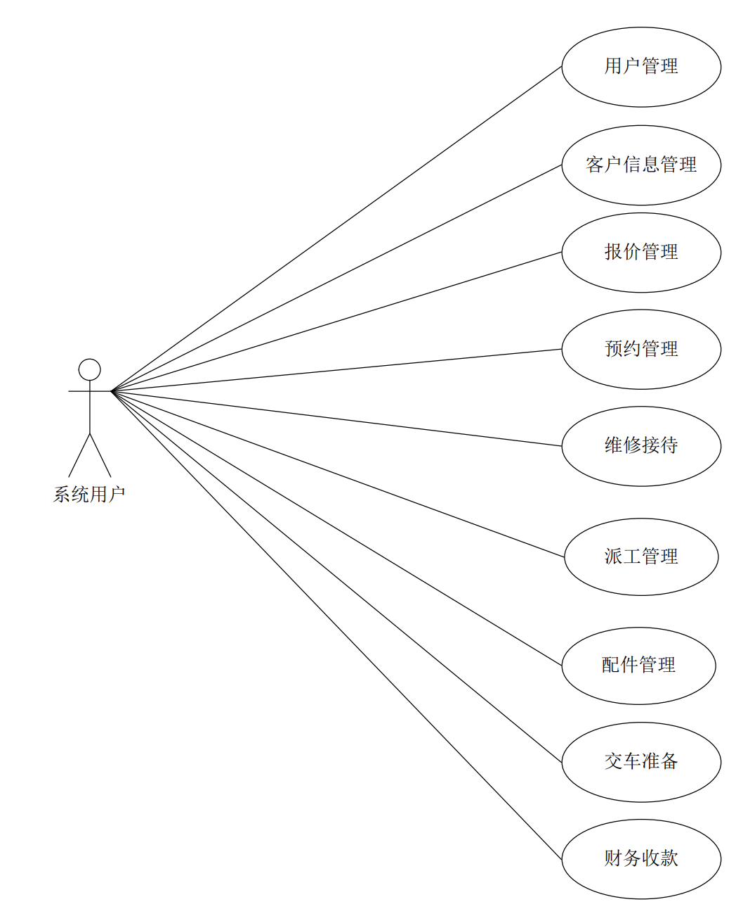
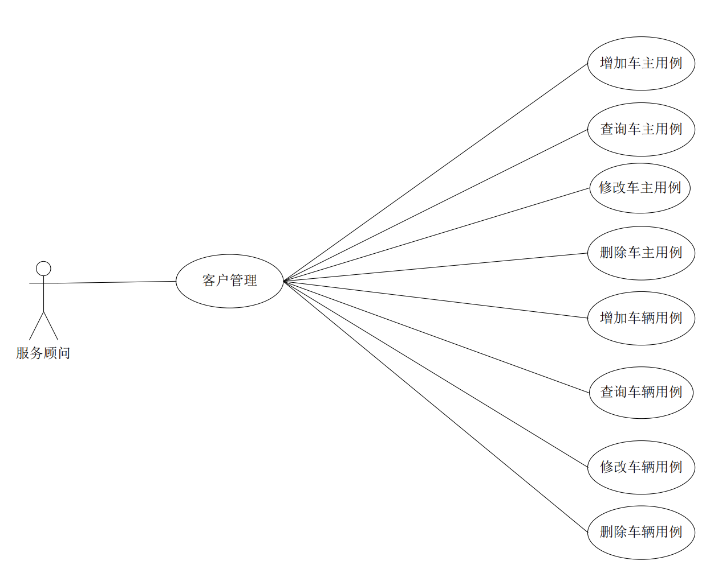
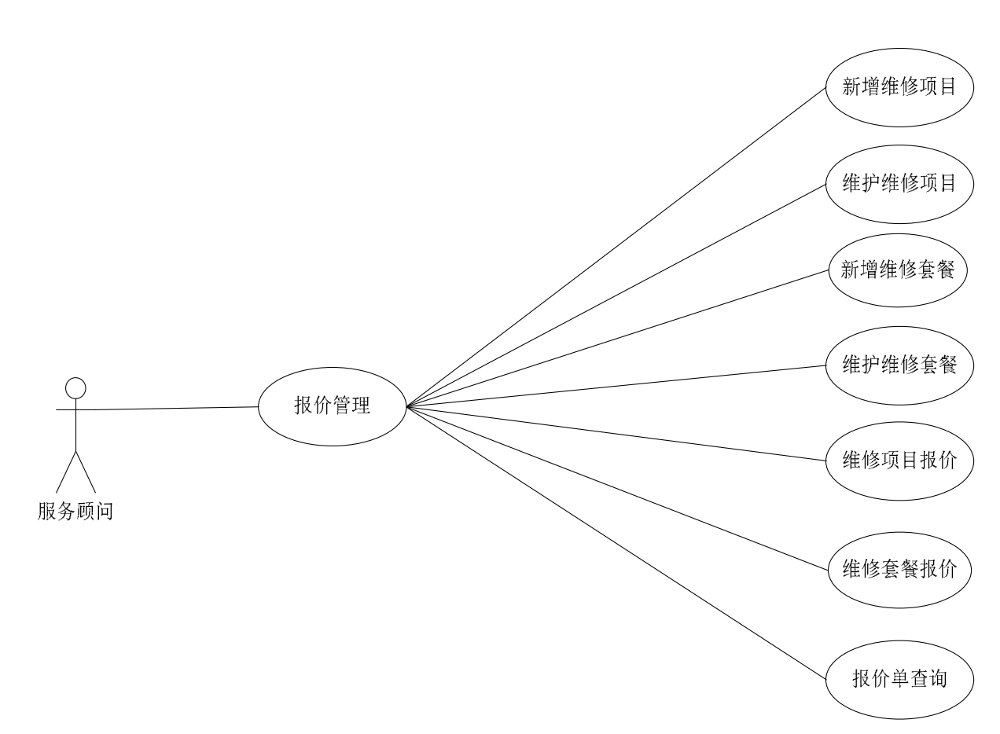
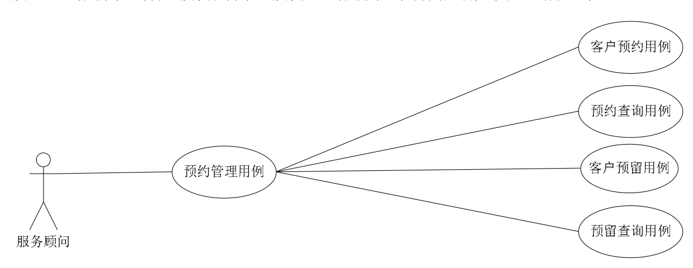
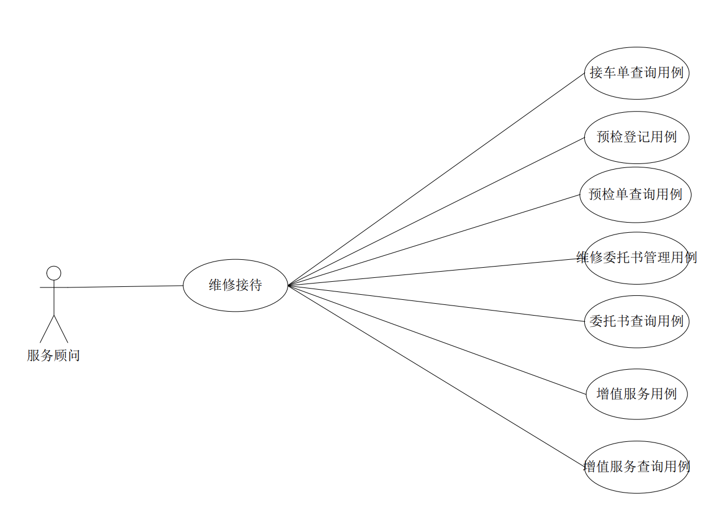

# 业务流程分析

# 系统功能需求概述

- 用户管理
  - 管理权
    > 分配功能权限
  - 客服权
    > 贯穿整个维修流程的实施和记录人员
  - 质检权
    > 维修前检测人员
  - 配件权
    > 出入库配件
  - 维修权
    > 施工维修
  - 财务权
    > 收款结账
- 客户管理
  - 基本信息管理
  - 车辆信息管理
  - 跟踪回访
- 报价管理
  - 维修项目的管理
  - 维修套餐的管理
  - 维修报价
  - 报价单查询
- 预约管理
  - 预约登记
  - 预约查询
  - 客户查询
- 维修接待
  - 登记查询
  - 增值服务
- 派工管理
  - 工时结算
  - 派工管理
- 配件管理
  - 入库管理
  - 领取配件
- 交车准备
  - 洗车服务管理
  - 终验竣工管理
  - 结算解释管理
  - 结算单查询
- 财务收款
  - 结算提车

# 用例分析

## 客户管理

## 报价管理

## 预约管理

## 接待

